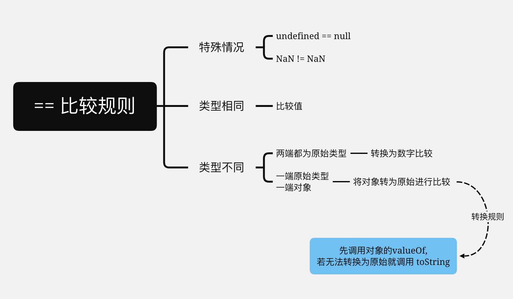

# 奇思妙想

## 实现 a == 1 && a == 2 && a == 3



```js
let a = {
	_a: 1,
	valueOf() {
		return this._a++;
	}
};
console.log(a == 1 && a == 2 && a == 3);
```

## 递归求和

> 假设有 `list = [1,2,3,4,5]` <br>
> 假设有 `f()` 可以求 list 第 i 位到末尾的和
> 那么 f(2) === list[2] + f(2 + 1)
> 可知 f(i) === list[i] + f(i + 1)
> i 必须小于数组长度

```js
function f(i) {
	return i >= list.length ? 0 : list[i] + f(i + 1);
}
```

## 实现九宫格分割图片

技术点:[:nth-child](./nth-child.md)

<image-9/>
